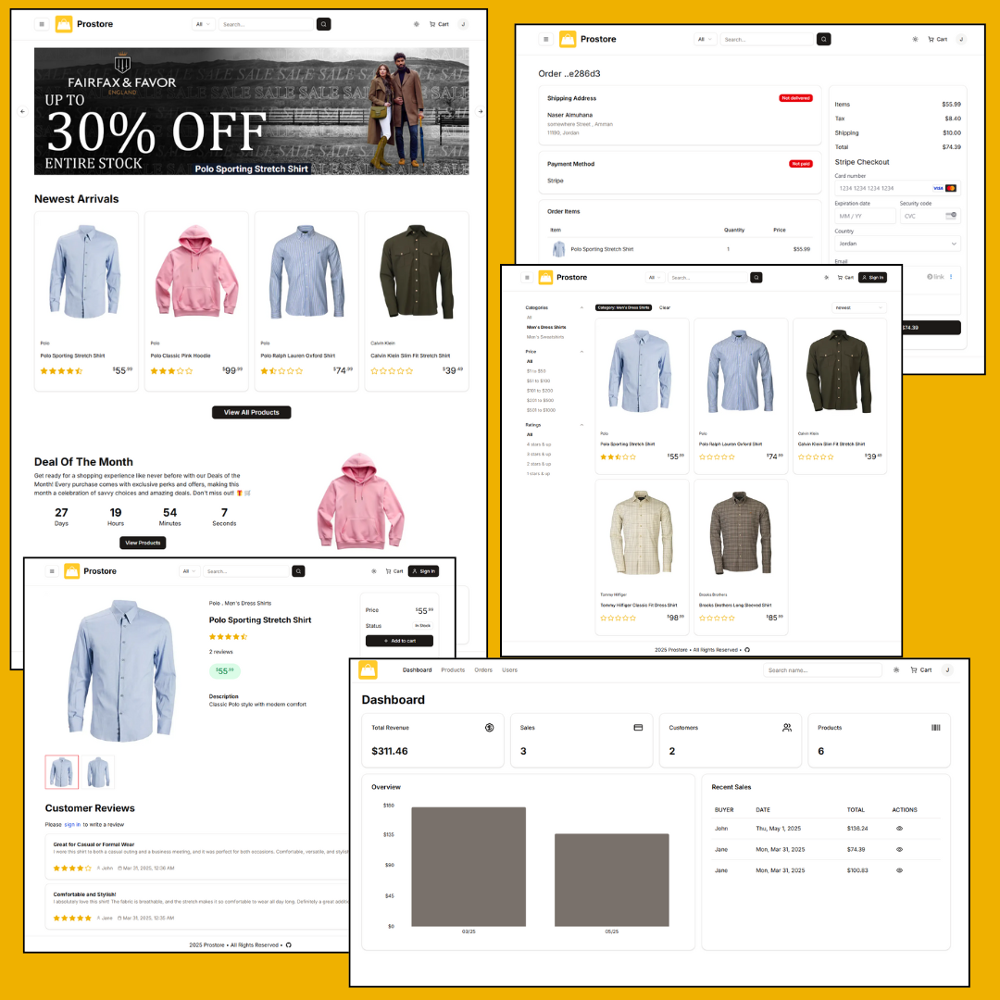

# ProStore E-Commerce Platform

**A full-stack storefront built to demonstrate the complete e-commerce journey: product discovery, customer accounts, checkout, payments, order management, and administration.**

[](https://pro-store-fullstack-e-commerce-plat.vercel.app/)
[](https://nextjs.org/)
[](https://react.dev/)
[](https://www.typescriptlang.org/)
[](https://www.postgresql.org/)

ProStore is a production-deployed e-commerce application with a searchable product catalog, persistent shopping carts, an order and payment flow, customer reviews, and a role-restricted admin dashboard. It brings the storefront and operational tools together in one application, with a PostgreSQL data model and server-side application logic.

> **Explore:** [Open the live store](https://pro-store-fullstack-e-commerce-plat.vercel.app/) · [Browse products](https://pro-store-fullstack-e-commerce-plat.vercel.app/search) · [View a product](https://pro-store-fullstack-e-commerce-plat.vercel.app/product/soft-knit-pullover)

## Product preview



## What you can do

### Shop and discover products

- Browse and search a catalog with category, price, and rating filters, plus sorting and pagination.
- View product details, availability, image galleries, and customer reviews.
- See distinct, locally served product photography instead of repeated category placeholders. The demo catalog contains 20 products in each of seven categories; image credits are documented in [`public/images/product-images/IMAGE-CREDITS.md`](./public/images/product-images/IMAGE-CREDITS.md).
- Add items to a shopping cart as a guest and keep shopping after signing in.

### Complete the customer journey

- Create an account, sign in, and manage a customer profile and shipping address.
- Review the cart, enter shipping details, choose an available payment method, and submit an order.
- View order details and status after checkout.
- Submit or update a product review. Product-card ratings show the average from saved reviews and the review count; unrated products are labeled **No reviews**.
- Receive purchase emails when the email provider is configured.

### Run store operations

- Use the admin dashboard to view store activity and manage products, orders, and users.
- Create, update, and delete products.
- Update order payment and delivery status using the admin workflow.
- Restrict order and administrative operations according to the signed-in user and role.

### Integrate payment providers

The checkout supports the payment methods configured for the deployment:

- **Stripe** for card payments.
- **PayPal** for PayPal checkout.
- **Cash on Delivery** for orders managed through the admin workflow.

Provider credentials are supplied through environment variables; use provider sandbox credentials for local development.

## Engineering highlights

- **End-to-end feature ownership:** the project connects catalog data, shopping-cart behavior, checkout, payment handling, saved orders, customer reviews, and store administration.
- **Typed data and validation:** Prisma models define the PostgreSQL domain, while Zod schemas validate data submitted through application actions.
- **Server-rendered application:** Next.js App Router pages and server actions keep data access and business operations close to the server-side application.
- **Role-aware workflows:** customer order access and admin capabilities are separated by authenticated user roles.
- **Cache-aware updates:** product, review, and order mutations invalidate relevant cached data so updated store content can be refreshed.
- **Repeatable catalog setup:** `npm run db:seed-products` adds missing demo products without deleting the rest of the database, synchronizes demo product prices and images, and verifies category counts and image uniqueness.
- **Thoughtful motion and image handling:** product-card and text animations respect reduced-motion preferences, and catalog images are served as local assets.

## Architecture and technology

| Area | Tools |
| --- | --- |
| Web application | Next.js 15 App Router, React 19, TypeScript |
| UI and styling | Tailwind CSS v4, Radix UI, shadcn-style components |
| Forms and validation | React Hook Form, Zod |
| Persistence | PostgreSQL, Prisma ORM |
| Authentication | Auth.js / NextAuth with the Prisma adapter |
| Payments | Stripe, PayPal, Cash on Delivery |
| Product image uploads | UploadThing |
| Email | Resend and React Email |
| Charts | Recharts |
| Deployment | Vercel |

### Request and data flow

1. App Router pages render the storefront and admin experiences.
2. Server actions validate submitted data and perform application operations.
3. Prisma reads and writes the PostgreSQL database.
4. Payment, image-upload, and email integrations connect through their configured providers.
5. Cache revalidation keeps product, review, and order views current after changes.

## Run locally

### Prerequisites

- Node.js 20 or later and npm.
- A PostgreSQL database.
- Provider accounts and credentials only for the integrations you intend to test (for example, Stripe, PayPal, UploadThing, or Resend).

### 1. Get the code and install dependencies

```bash
git clone https://github.com/sojibpannashovon2/ProStore---Fullstack-eCommerce-Platform.git
cd ProStore---Fullstack-eCommerce-Platform
npm install
```

### 2. Configure environment variables

Copy the example configuration and add local values:

```bash
cp .env.example .env
```

At minimum, configure a PostgreSQL `DATABASE_URL`, an `AUTH_SECRET`, an `ENCRYPTION_KEY`, and the local `NEXT_PUBLIC_SERVER_URL`. Set `AUTH_TRUST_HOST=true` when running locally. Add the Stripe, PayPal, UploadThing, and Resend credentials for any integrations you want to exercise.

Keep `.env` out of version control. Never put server-side provider secrets in `NEXT_PUBLIC_*` variables or commit real credentials.

### 3. Generate Prisma Client and apply migrations

```bash
npx prisma generate
npx prisma migrate deploy
```

### 4. Add the demo catalog (optional)

```bash
npm run db:seed-products
```

This is the additive demo-product seeder. It does not clear the database. Avoid running destructive database scripts against production data.

### 5. Start the development server

```bash
npm run dev
```

Open [http://localhost:3000](http://localhost:3000).

### 6. Check a production build

```bash
npm run build
npm run start
```

## Environment configuration

Use [`.env.example`](./.env.example) as the source of truth for variable names. Configuration includes:

| Purpose | Variables |
| --- | --- |
| App metadata and base URL | `NEXT_PUBLIC_APP_NAME`, `NEXT_PUBLIC_APP_DESCRIPTION`, `NEXT_PUBLIC_SERVER_URL` |
| Database | `DATABASE_URL` |
| Authentication and encryption | `AUTH_SECRET`, `AUTH_TRUST_HOST`, `ENCRYPTION_KEY` |
| Payment methods | `PAYMENT_METHODS`, `DEFAULT_PAYMENT_METHOD` |
| PayPal | `PAYPAL_API_URL`, `PAYPAL_CLIENT_ID`, `PAYPAL_APP_SECRET` |
| Stripe | `NEXT_PUBLIC_STRIPE_PUBLISHABLE_KEY`, `STRIPE_SECRET_KEY`, `STRIPE_WEBHOOK_SECRET` |
| Image uploads | `UPLOADTHING_TOKEN`, `UPLOADTHING_SECRET`, `UPLOADTHING_APPID` |
| Email | `RESEND_API_KEY`, `SENDER_EMAIL` |

Only configure real provider credentials in the appropriate local or deployment environment. Use test or sandbox credentials for development.

## Useful commands

| Command | Description |
| --- | --- |
| `npm run dev` | Start the local development server. |
| `npm run build` | Create and type-check a production build. |
| `npm run start` | Serve the production build locally. |
| `npm run lint` | Run the configured lint command. |
| `npx prisma generate` | Generate Prisma Client from the schema. |
| `npx prisma migrate deploy` | Apply checked-in migrations to the configured database. |
| `npm run db:seed-products` | Add and verify the demo catalog. |
| `npm run db:studio` | Open Prisma Studio for the configured database. |

## Project layout

```text
app/          Storefront, checkout, account, admin, and API routes
components/   Shared UI and reusable components
db/           Prisma client and demo catalog seeding
lib/actions/  Server-side product, cart, order, review, and account operations
lib/          Authentication, integrations, validation, and utilities
prisma/       Database schema and migrations
public/       Storefront assets and distinct catalog product photos
types/        Shared TypeScript types
```

## License

MIT. See [LICENSE](./LICENSE) for details.
